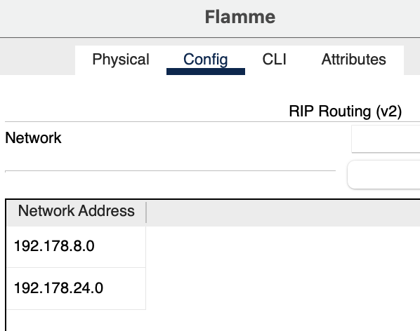
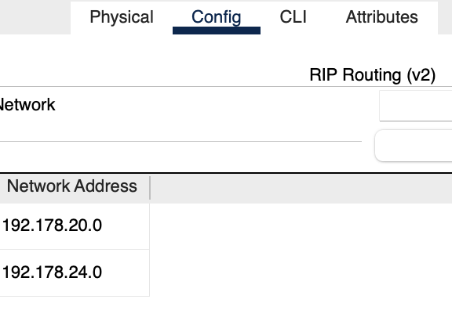

# Laporan Resmi

# Kelompok A19:
| Nama | NRP |
| ---------------------- | ---------- |
| Nayya Kamila Putri Y | 5025211183 |
| Javier Nararya Aqsa Setiyono | 5025211245 |

## Topologi dan Pembagian Subnet

## VLSM (Cisco Packet Tracer)

## Subnetting

Hitung jumlah host di setiap subnet serta rutenya, lalu tetapkan netmask untuk setiap subnet.

Diperhatikan bahwa total host yang dibutuhkan adalah 4257, sehingga netmask subnet besar yang cocok untuk penggunaan tersebut adalah /19

Selanjutnya, buat Tree menggunakan metode VLSM (Variable Length Subnet Mask) untuk mengakomodasi kebutuhan host tersebut

Lalu cari Network ID, Netmask, dan Broadcast Address tiap Subnetnya

Setelah didapatkan semua IP-nya, dapat langsung diimplementasikan di Cisco Packet Tracer

## Implementasi VLSM di Cisco
## Routing

### Fern

### Flamme

### Himmel

### Frieren

### Aura

### Denken

### Elsen

### Linie

### Lawine

### Heiter

## Hasil Testing
Berikut adalah beberapa hasil testing yang sudah di lakukan

